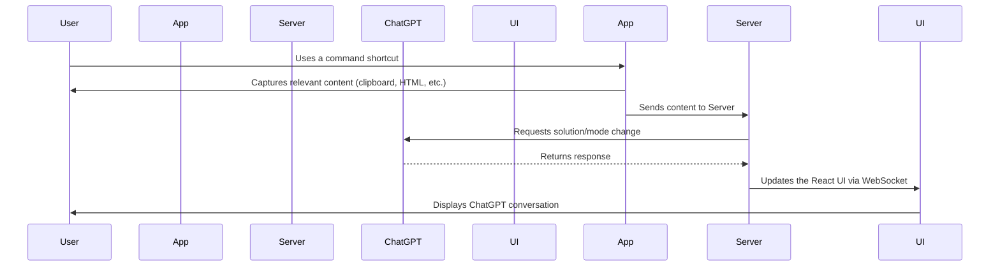

# CodeSolver Electron Extension 🚀

**CodeSolver** is a cutting-edge Electron extension designed to supercharge your coding sessions. Whether you're studying algorithms, working on system design, or just brainstorming, leverage the unparalleled power of OpenAI's ChatGPT to gain insights, solutions, and suggestions. Housed conveniently in your system tray, the extension provides quick commands to capture content and converse with ChatGPT.


## Features 🌟

- **Diverse Interaction Modes**: Multiple command shortcuts to read from clipboard, capture active HTML, start/stop keyboard recording, and more.
- **Versatile Assistant Modes**: Switch between algorithms, system design, and free-form modes for context-aware assistance.
- **Conversational Context**: Set the nature of your conversation - be it a question, follow-up, or correction.
- **Real-time Interface**: An interactive React UI, powered by a WebSocket, to broadcast your AI conversations.
- **Inbuilt Server**: Integrated Express server within the app for streamlined interactions.

## Getting Started 🛠

### Prerequisites

- Electron
- Node.js & npm

### Installation

1. Clone the repo:
    ```bash
    git clone your-repo-link-goes-here.git
    ```

2. Navigate to the project directory and install the necessary packages:
    ```bash
    cd codesolver-directory && npm install
    ```

3. Start the Electron app:
    ```bash
    npm start
    ```

## Diagram


## TODO 📝
- Soft skills mode

## Contributing 💡
Pull requests are welcome. For major changes, please open an issue first to discuss what you'd like to change.

## License 📜
This project is licensed under the MIT License - see the LICENSE.md file for details.

## Acknowledgments 👏
OpenAI's ChatGPT for offering a powerful computational engine.
Electron, React, and Express communities for their robust frameworks.