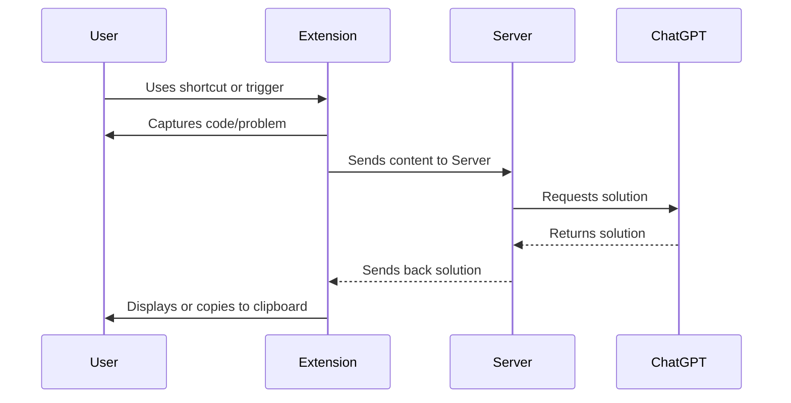

# CodeSolver Chrome Extension 🚀

**CodeSolver** is an innovative Chrome extension designed to aid learners and enthusiasts in studying computer science algorithms and code assignments. With just a keyboard shortcut, users can leverage the power of OpenAI's ChatGPT to solve a coding challenge or problem in a specified format. Ideal for platforms like CodeSignal, LeetCode, and HackerRank, this tool captures pre-selected HTML selectors and processes the content through a dedicated server to fetch real-time solutions.




## Features 🌟

- **Instant Code Assistance**: Send code challenges to OpenAI ChatGPT and receive solutions instantly.
- **Multilanguage Support**: Switch between multiple coding languages.
- **Audio Prompting**: For those who prefer auditory cues.
- **Versatile Interactions**: Correct, modify, or even test with random inputs using keyboard shortcuts.
- **Real-time Monitoring**: A dedicated server with a websocket to monitor and display latest responses.

## Getting Started 🛠

### Prerequisites

- Chrome browser
- Node.js & npm installed

### Installation

1. Clone the repo:
    ```bash
    git clone git@github.com:x-hq/algo-helper.git
    ```

2. Navigate to the server directory and install the necessary packages:
    ```bash
    cd server && npm install
    ```


3. Copy the `server/.env.example` files and fill with own keys.

   ```
   NODE_ENV=development
   OPENAI_API_KEY= # Get from https://platform.openai.com/account/api-keys
   OPENAI_ORG= # Get from https://platform.openai.com/account/org-settings
   ```

5. Start the server:
    ```bash
    npm run dev
    ```

6. Install the Chrome extension:
    - Open Chrome and go to `chrome://extensions/`
    - Enable "Developer mode" and click "Load unpacked"
    - Select the `chrome-extension` from the project

## TODO 📝

### Server

- [ ] Should have HTTP GET endpoint with subscription/websocket that displays latest responses 
- [ ] Deployment somewhere

### Chrome Extension

- [ ] Move to TypeScript
- [ ] Keyboard shortcut for sending clipboard contents
- [ ] Keyboard shortcut for correction mode
- [ ] Keyboard shortcut for random input
- [ ] Dropdown menu with options
    - Select other output languages
- [ ] Audio prompting

## Contributing 💡

Pull requests are welcome. For major changes, please open an issue first to discuss what you would like to change.

## License 📜

This project is licensed under the MIT License - see the [LICENSE.md](LICENSE.md) file for details.

## Acknowledgments 👏

- Platforms like CodeSignal, LeetCode, HackerRank for inspiring this project.
- OpenAI's ChatGPT for providing a robust solution engine.

